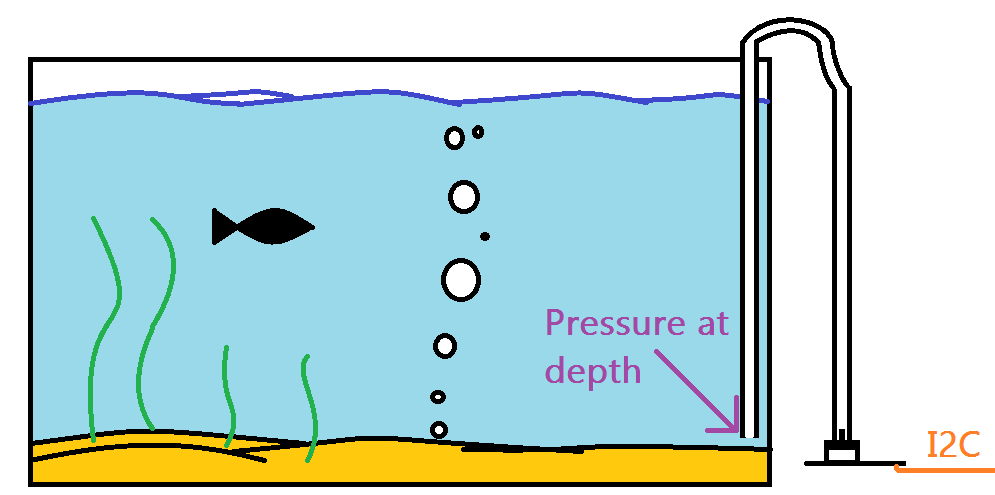

# I2C Water Level Sensor V1.0

Pressure water level sensor interfaced via I2C - Open Source Hardware

## Getting Started

Begin by installing the MCP3221 library either by using the Arduino IDE's Installation Wizard (Arduino Version >1.5) or simply download the library's ZIP folder from GITHUB, extract it, and copy the extraxcted MCP3221 folder to your Arduino 'libraries' folder.

Then connect the Arduino using the wire guidelines for [I2C](https://www.arduino.cc/en/Reference/Wire).

Next, open the sample .ino file in WLS_v1.0. Compile and run this. It will output pressure in KPa.

Then place the tube connected to the sensor into tank of fluid you wish to measure. Do this such that __**THERE IS AIR IN THE TUBE ALL THE WAY TO THE POINT YOU WISH TO MEASURE.**__ If this is done incorrectly and fluid rises in tube, your results will be incorrect.

Part used for water level senseing: https://www.nxp.com/docs/en/data-sheet/MPX5010.pdf

## Upcoming updates
* Better pictures of sensor
* Picture with tubing and wires
* Diagram of system

## Contributors

Thank you to [Nadav Matalon](https://github.com/nadavmatalon/MCP3221) for making the MCP3221 ADC library that makes this possible

## License

MIT License

Copyright (c) 2018 Justin Hynes-Bruell

Permission is hereby granted, free of charge, to any person obtaining a copy
of this software and associated documentation files (the "Software"), to deal
in the Software without restriction, including without limitation the rights
to use, copy, modify, merge, publish, distribute, sublicense, and/or sell
copies of the Software, and to permit persons to whom the Software is
furnished to do so, subject to the following conditions:

The above copyright notice and this permission notice shall be included in all
copies or substantial portions of the Software.

THE SOFTWARE IS PROVIDED "AS IS", WITHOUT WARRANTY OF ANY KIND, EXPRESS OR
IMPLIED, INCLUDING BUT NOT LIMITED TO THE WARRANTIES OF MERCHANTABILITY,
FITNESS FOR A PARTICULAR PURPOSE AND NONINFRINGEMENT. IN NO EVENT SHALL THE
AUTHORS OR COPYRIGHT HOLDERS BE LIABLE FOR ANY CLAIM, DAMAGES OR OTHER
LIABILITY, WHETHER IN AN ACTION OF CONTRACT, TORT OR OTHERWISE, ARISING FROM,
OUT OF OR IN CONNECTION WITH THE SOFTWARE OR THE USE OR OTHER DEALINGS IN THE
SOFTWARE.
